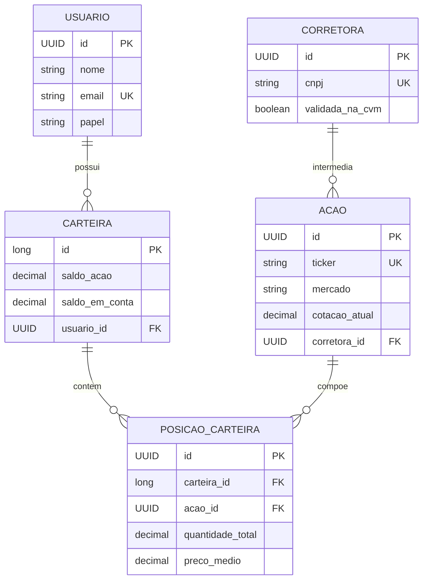

# API de Gestao de Acoes e Corretoras

API REST em Java 17 e Spring Boot para cadastro de corretoras e acoes, com consulta de dados reais em fontes publicas.

## Requisitos atendidos

- Cadastro de corretora a partir de CNPJ, com validacao de formato e digitos verificadores.
- Consulta de dados empresariais na Brasil API e validacao de CEP no ViaCEP antes da persistencia.
- Identificacao de instituicao do mercado financeiro por situacao cadastral, CNAE e denominacao empresarial, registrada no campo `validadaNaCvm`.
- Cotacao de acoes brasileiras pela brapi e americanas pela Alpha Vantage.
- Ticker e CNPJ unicos no banco de dados.
- Endpoints REST, DTOs, tratamento centralizado de erros e cache para CNPJ/CEP.
- Login com perfis `ADMIN` e `USER`; o administrador cuida do catalogo e o usuario investe na propria carteira.
- Carteira criada zerada para toda nova conta. O cadastro nao autentica automaticamente o usuario.

## Arquitetura

`Controller -> Service -> Repository -> Entity`, com DTOs de entrada e saida na API. As integracoes externas sao isoladas por portas no dominio e adapters na infraestrutura.

```text
api/controller       Endpoints HTTP e autenticacao
service              Regras de negocio
repository           Persistencia JPA
domain/model         Entidades
domain/dto           Contratos HTTP
domain/port          Contratos de integracao
infra/adapter        Implementacoes das integracoes
infra/client         Clientes OpenFeign
```

## Fontes externas

| Uso | Servico | Endpoint principal |
|---|---|---|
| Dados empresariais | Brasil API | `/api/cnpj/v1/{cnpj}` |
| Endereco | ViaCEP | `/ws/{cep}/json/` |
| Cotacao BR | brapi | `/api/quote/{ticker}` |
| Cotacao US | Alpha Vantage | `GLOBAL_QUOTE` |

As cotacoes dependem de rede e dos limites dos provedores. A Alpha Vantage exige uma chave propria. Erros de indisponibilidade, limite, credencial e recurso inexistente retornam JSON com `timestamp`, `status`, `error` e `message`.

## Configuracao

Use `.env.example` como referencia e configure as variaveis no terminal ou na configuracao de execucao da IDE. O Spring Boot nao carrega um arquivo `.env` automaticamente. Nao versione chaves reais.

| Perfil | Banco | Como ativar |
|---|---|---|
| `test` (padrao) | H2 em memoria | sem variavel adicional |
| `dev` | PostgreSQL | `SPRING_PROFILES_ACTIVE=dev` |
| `mysql` | MySQL | `SPRING_PROFILES_ACTIVE=mysql` |

Variaveis de cotacao:

```properties
BRAPI_TOKEN=
ALPHAVANTAGE_API_KEY=sua_chave
```

No PowerShell, por exemplo:

```powershell
$env:ALPHAVANTAGE_API_KEY = "sua_chave"
$env:SPRING_PROFILES_ACTIVE = "dev"
.\mvnw.cmd spring-boot:run
```

## Execucao

Backend:

```powershell
.\mvnw.cmd test
.\mvnw.cmd spring-boot:run
```

Frontend:

```powershell
Set-Location src\main\front
npm.cmd install
npm.cmd run dev
```

Abra `http://127.0.0.1:5173`. A API fica em `http://localhost:8080` e o H2 esta disponivel em `http://localhost:8080/h2-console` no perfil `test`.

Perfis locais iniciais: `admin@corretora.local` / `admin123` e `usuario@corretora.local` / `user123`. Altere essas credenciais em qualquer ambiente compartilhado.

## Autenticacao e permissoes

1. `POST /auth/login` retorna um token de sessao.
2. Envie `Authorization: Bearer <token>` nas rotas protegidas.
3. `ADMIN` cadastra corretoras e ativos, atualiza cotacoes e consulta os dados gerais da plataforma.
4. `USER` realiza aporte, compra e vende ativos somente na propria carteira.

`POST /auth/register` cria uma conta `USER`, uma carteira com saldos `0` e retorna o usuario sem token. O login e uma etapa separada.

## Endpoints obrigatorios

| Metodo | Rota | Regra |
|---|---|---|
| POST | `/corretoras` | ADMIN; recebe somente `cnpj` |
| GET | `/corretoras` | lista corretoras |
| GET | `/corretoras/{id}` | busca por ID |
| GET | `/corretoras/cnpj/{cnpj}` | busca por CNPJ |
| POST | `/acoes` | ADMIN; consulta cotacao e cria ticker unico no catalogo |
| GET | `/acoes` | lista acoes cadastradas |
| GET | `/acoes/{id}` | busca por ID |
| GET | `/acoes/ticker/{ticker}` | busca por ticker |
| PUT | `/acoes/{id}/atualizar-cotacao` | ADMIN; atualiza pela API adequada |

Rotas adicionais: `GET /acoes/minhas` lista as posicoes do investidor, `PUT /acoes/{id}` compra uma quantidade para a propria carteira, `POST /acoes/{ticker}` vende uma quantidade da propria carteira e `POST /carteiras/principal/aportes` adiciona saldo para investir.

## Diagrama ER



## Testes e collection

Execute `./mvnw.cmd test` para os testes unitarios e de contexto. A collection atualizada esta em [docs/postman_collection.json](docs/postman_collection.json); ela mantem tokens separados para administrador e investidor. Primeiro crie a corretora e o ativo como administrador; depois execute o login do investidor, o aporte e as operacoes de compra/venda.
